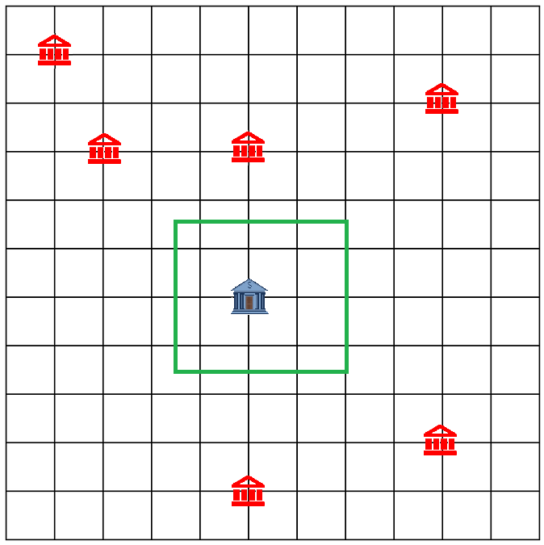

# Rdist

Mr Vien is a great tycoon. It is said that:

"Where Vien drops a wallet, a bank pops up.
Where the bank pops up, a new nation is built"

Suppose the Earth is a Cartesian plane

Define $R(x, y)$ as the territory of the country whose bank is placed at $(x, y)$. This territory include every point **(integral or not)** $(x', y')$ that satisfies: $|x-x'| \leq |x_1-x'|$ và $|y-y'| \leq |y_1-y'|$ for every points $(x_1, y_1)$ that accomodates another bank.



Define $D(P, A)$ for $P = (u, v)$ as the shortest distance from $(u, v)$ to $A$. In other words, $D(P, A) = min(|u - x| + |v - y|) \space \forall \space (x, y) \in A$.

Define $G(u, v, S_1, S_2)$ ($S_0, S_1 \in \{“<=”, “>=”\}$) as points in the $S_1S_2$ "quadrant" of $(u,v)$. In other words: $G(u, v, S_1, S_2) = $ $\{(u', v')$ $|$ $u' S_0 u$ $\&$ $v' S_1 v\}$

You have to process queries of 2 types:

- $1$ $x$ $y$: Vien drops a wallet while travelling to $(x, y)$, i.e., A bank appears at $(x,y)$ and a nation is built accordingly.

- $2$ $u$ $v$ $S_0$ $S_1$ ($S_0, S_1 \in \{“<=”, “>=”\}$): Vien is currently at the point $P=(u, v)$ and he wants to visit the furthest country possible in the $S_0S_1$ quadrant. In other words, you need to calculate: $max(D(P, R'(x,y))$ $(R'(x,y)= R(x,y) \cap G(u,v,S_1,S_2))$ for every points $(x, y)$ that accomodates a bank.


**Note**: The creation of a nation may change the territory of one or several other nations.

## Input

- The first line has integer $T$ - the subtask containing the test.
- THe second line has integer $Q$ - the number of queries.
- $Q$ lines contains a query $1$ $x$ $y$ or $2$ $u$ $v$ $S_1$ $S_2$

## Output	

For each query of type 2, print the answer to the $1^{st}$ decimal digit. If Vien cannot reach any country, print $-1$

## Constraints
- $Q \leq 250,000$
- $0 \leq x, y, u, v \leq 100,000,000$
- It is guaranteed that there is at least one query of each type, and the first query is of type 1.

## Subtask
- Subtask 1 (15%): All $x$ coordinate of the banks are equal.
- Subtask 2 (15%): $Q \leq 1000$
- Subtask 3 (20%): All type 1 queries come before any type 2 queries.
- Subtask 4 (20%): All $x$ coordinates are different and all $y$ coordinates are different.
- Subtask 3 (30%): No additional constraints.

## Sample

### Input
```
2
16
1 2 2
1 8 7
1 14 5
2 9 1 >= >=
1 4 6
1 2 8
1 10 8
1 11 3
2 16 10 >= >=
1 5 3
1 4 1
1 7 5
1 7 8
2 11 5 <= <=
2 3 5 >= <=
2 7 3 <= >=
Output
2
-1.0
10.5
9.5
8.5
```

### Output
```
5
-1
10.5
9.5
8.5
```