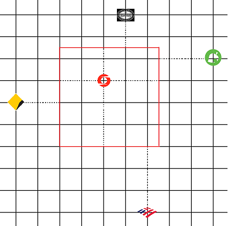
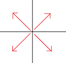

# Rdist

Cu Viễn là một nhà tài phiệt lớn. Giang hồ đồn đoán rằng:

"Viễn đánh rơi ví tiền ở đâu, chỗ đó sẽ mọc lên 1 ngân hàng.
Mỗi ngân hàng mọc lên, chỗ đó sẽ thành lập 1 quốc gia."

Giả sử trái đất là một mặt phẳng tọa độ Descartes.

Gọi $R(x, y)$ là vùng lãnh thổ của quốc gia có ngân hàng đặt tại tọa độ $(x, y)$. Vùng lãnh thổ này bao gồm tất cả mọi điểm **nguyên hoặc không nguyên** $(x', y')$ thỏa mãn: $|x-x'| \leq |x_1-x'|$ và $|y-y'| \leq |y_1-y'|$ với mọi $(x_1, y_1)$ mà tại đó có một ngân hàng khác.



Gọi $D(P, A)$ với $P = (u, v)$ là khoảng cách ngắn nhất từ điểm $(u, v)$ đến $A$. Nói cách khác, $D(P, A) = min(|u - x| + |v - y|) \space \forall \space (x, y) \in A$.

Gọi $G(u, v, S_1, S_2)$ ($S_0, S_1 \in \{“<=”, “>=”\}$) là vùng đến được nếu xuất phát từ $(u,v)$ và đi theo "hướng" $S_1S_2$. Nghĩa là: $G(u, v, S_1, S_2) = $ $\{(u', v')$ $|$ $u' S_0 u$ $\&$ $v' S_1 v\}$

Bạn sẽ phải xử lý các truy vấn thuộc 1 trong 2 loại sau:

- $1$ $x$ $y$: Viễn đánh rơi 1 chiếc ví trong chuyến du ngoạn đến $(x, y)$. Tại đó mọc lên 1 ngân hàng và thành lập 1 quốc gia mới.

- $2$ $u$ $v$ $S_0$ $S_1$ ($S_0, S_1 \in \{“<=”, “>=”\}$): Viễn hiện đang ở điểm $P=(u, v)$ và muốn du ngoạn tới 1 quốc gia nào đó bằng 1 trong 4 hướng. Vì là dân chơi nên Viễn muốn đến quốc gia xa nhất có thể. Nói cách khác, bạn cần tính: $max(D(P, R'(x,y))$ $(R'(x,y)= R(x,y) \cap G(u,v,S_1,S_2))$ $\forall$ $(x, y)$ có chứa ngân hàng.



**Lưu ý**: việc thành lập 1 quốc gia mới có thể làm thay đổi vùng lãnh thổ của 1 số quốc gia khác.

## Input

- Dòng đầu tiên chứa số nguyên $T$ - số thứ tự của subtask chứa test đó.
- Dòng thứ 2 chứa số $Q$ - số truy vấn.
- $Q$ dòng tiếp theo, mỗi dòng chứa 1 truy vấn có dạng: $1$ $x$ $y$ hoặc $2$ $u$ $v$ $S_1$ $S_2$

## Output	

Với mỗi truy vấn loại 2, in ra đáp án của truy vấn đó, làm tròn đến chữ số thập phân thứ nhất. Nếu Viễn không thể đến được quốc gia nào, in ra $-1$.

## Giới hạn
- $Q \leq 250,000$
- $0 \leq x, y, u, v \leq 100,000,000$
- Đảm bảo có ít nhất 1 truy vấn mỗi loại, và truy vấn đầu tiên là truy vấn loại 1.

## Subtask
- Subtask 1 (15% số điểm): Mọi tọa độ $x$ của các ngân hàng đều bằng nhau.
- Subtask 2 (15% số điểm): $Q \leq 1000$
- Subtask 3 (20% số điểm): Không có truy vấn loại 2 nào được hỏi trước 1 truy vấn loại 1.
- Subtask 4 (20% số điểm): Tất cả các ngân hàng đều có tọa độ $x$ và $y$ phân biệt.
- Subtask 5 (30% số điểm): Không có điều kiện gì thêm.

## Sample

### Input
```
2
16
1 2 2
1 8 7
1 14 5
2 9 1 >= >=
1 4 6
1 2 8
1 10 8
1 11 3
2 16 10 >= >=
1 5 3
1 4 1
1 7 5
1 7 8
2 11 5 <= <=
2 3 5 >= <=
2 7 3 <= >=
Output
2
-1.0
10.5
9.5
8.5
```

### Output
```
5
-1
10.5
9.5
8.5
```